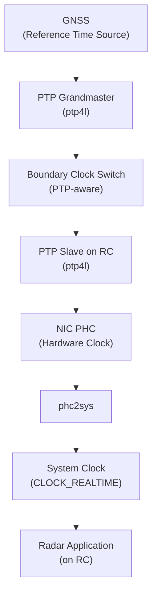
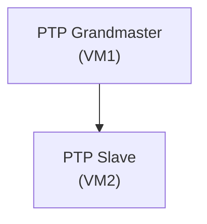

# Single-Site Full Implementation

Nodes:
- GNSS: provides the reference time source
- PTP Grandmaster (GM): site-local clock disciplined by GNSS
- Boundary Clock Switch (BC): PTP-aware switch that relays timing from GM
- ptp4l: PTP slave process on RC that disciplines the NIC PHC to the GM
- phc2sys: disciplines the system clock (CLOCK_REALTIME) from the NIC PHC

Functions
- Applications read system clock
- Radar App runs the ptp4l, PHC, phc2sys, and other apps.

# Single-Site Software Timestamping (this project)

## Multi-Site Full Implementation
- Site A (GNSS + GM + BC + Radar)
- Site B (GNSS + GM + BC + Radar)
- Site C (GNSS + GM + BC + Radar)

Each site runs an independent PTP domain.
Cross-site alignment is via GNSS, not PTP over WAN.