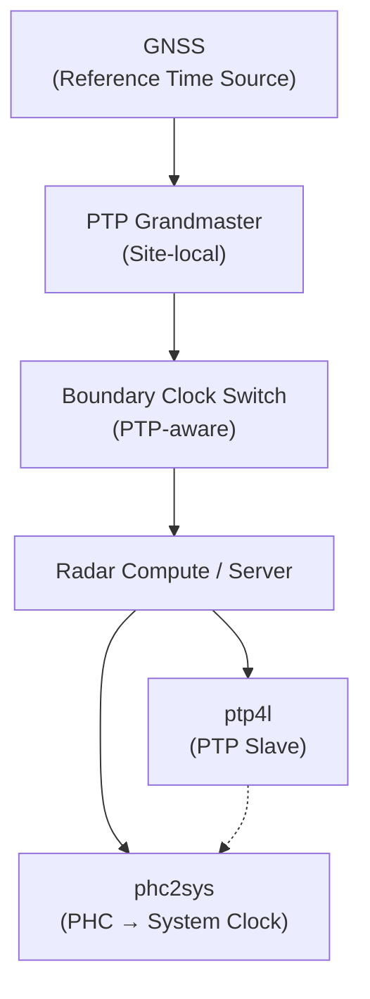

# Single-Site (Baseline)

## Multi-Site (Future)
- Site A (GNSS + GM + BC + Radar)
- Site B (GNSS + GM + BC + Radar)
- Site C (GNSS + GM + BC + Radar)

Each site runs an independent PTP domain.
Cross-site alignment is via GNSS, not PTP over WAN.